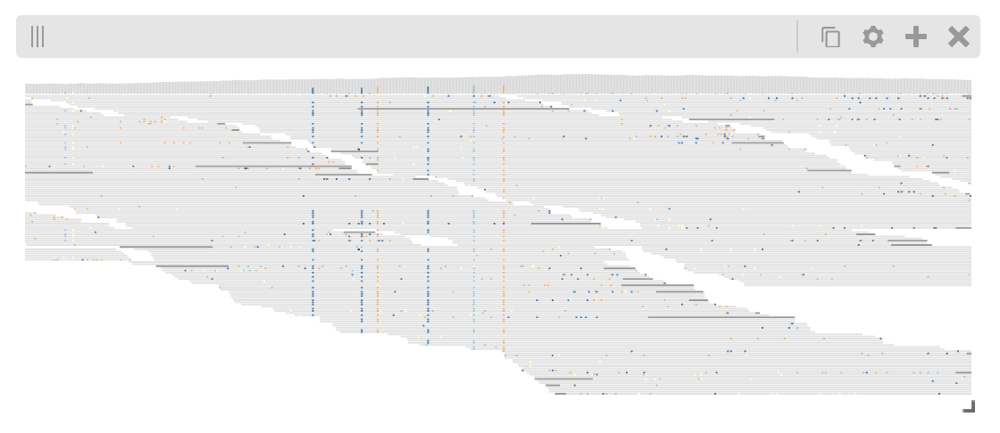

Examples
########

Passing in an auth token
------------------------

If the source higlass server requires authentication, an auth token
can be passed in to the `Authorization` header of the request. To do
this, the viewer needs to be instantiated as a widget with the
contents of the authorization header passed in.

.. code-block:: python

    from higlass import view

    v1 = view(...)
    v1.widget(authToken=f"Bearer <my_token>")

Synchronizing location, zoom and value scales
---------------------------------------------

To synchronize, the locations, zoom levels and value scales, use the provided
``hg.lock`` to create a lock object and then register the given lock for the
visualization with ``hg.Viewconf.locks()``.

.. code-block:: python

    import higlass as hg

    ts = hg.remote(
      uid='CQMd6V_cRw6iCI_-Unl3PQ',
      server="http://higlass.io/api/v1/",
    )

    # the entire viewport has a width of 12 so a width of 6 for
    # each view means they take up half the width
    view1 = hg.view(
        ts.track("chromosome-labels"),
        ts.track("heatmap"),
        width=6,
    )

    view2 = hg.view(
        ts.track("chromosome-labels"),
        ts.track("heatmap"),
        width=6,
    )

    lock = hg.lock(view1, view2)

    (view1 | view2).locks(lock)

Multivec Files
---------------

To view multivec files, create the multivec and output file:

.. code-block:: python

    from clodius.multivec import create_multivec_multires

    output_file = "/Users/pete/tmp/my_file.multires.hdf5"

    create_multivec_multires(
        array,
        [('chr1', chrom_len)],
        agg=lambda x: np.nansum(x.T.reshape((x.shape[1], -1, 2)), axis=2).T,
        starting_resolution=1,
        row_infos = ["match", 'a', 'g', 't'],
        output_file=output_file,
        tile_size=256
    )

Create the viewer. The `horizontal-stacked-bar` track is a plugin track so we
have to pass in its url so higlass knows where to load it.

.. code-block:: python

    import higlass as hg

    ts = multivec(output_file)
    view = hg.view(
        hg.track("top-axis", height=20),
        ts.track("horizontal-stacked-bar", height=50,
            plugin_url="https://unpkg.com/higlass-multivec/dist/higlass-multivec"
        ),
    )
    view.domain(x=[0, 1000000])

Pileup track
------------

The **higlass-python** package also provides a way to include custom tracks in
your view configuration. These tracks are defined in a separate (JavaScript)
package, and can be included in Python in with some additional setup.

The ``PluginTrack`` provides a mechanism to hook into the schema validation
as well as provide the plugin source for the renderer. The ``plugin_url`` is a
special field which points to the JavaScript source code.

A plugin can be created by subclassing ``hg.PluginTrack`` and specifying the ``type``
and ``plugin_url``. For example,

.. code-block:: python

    from typing import Literal, ClassVar
    import higlass as hg

    class PileupTrack(hg.PluginTrack):
        type: Literal["pileup"] = "pileup"
        plugin_url: ClassVar[str] = "https://unpkg.com/higlass-pileup/dist/higlass-pileup.min.js"

    # Specify the track-specific data
    pileup_data = {
        "type": "bam",
        "url": "https://pkerp.s3.amazonaws.com/public/bamfile_test/SRR1770413.sorted.bam",
        "chromSizesUrl": "https://pkerp.s3.amazonaws.com/public/bamfile_test/GCF_000005845.2_ASM584v2_genomic.chrom.sizes",
        "options": {"maxTileWidth": 30000},
    }

    # Create and use the custom track
    pileup_track = PileupTrack(data=pileup_data, height=180).opts(
        axisPositionHorizontal="right",
        axisLabelFormatting="normal",
        showCoverage=True,
        colorScale=[
            "#2c7bb6","#92c5de","#ffffbf","#fdae61","#808080", "#DCDCDC",
        ],
    )

    view = hg.view((pileup_track, "top")).domain(x = [1_636_200, 1_636_800])
    view

