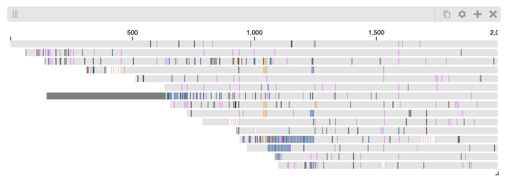

Examples
########

Synchronizing location, zoom and value scales
---------------------------------------------

To synchronize, the locations, zoom levels and value scales, use the provided
``location_syncs``, ``zoom_syncs`` and ``value_scale_syncs`` parameters of
the of the ``display`` function.

The ``location_syncs`` and ``zoom_syncs`` parameters both take a list of lists
of views which will have their location and / or zoom synchronized. While the
HiGlass implementation allows for synching of location and zoom independently
at a given offset, the Python API currently only allows synchronization at
the same location and / or same zoom level. It is highly recommended that the
zoom and location syncs are both provided and identical to ensure that zoom
and location change together in the provided list of views.

.. code-block:: python

	from higlass.client import View, Track
	import higlass

	t1 = Track(track_type='top-axis', position='top')
	t2 = Track(track_type='heatmap', position='center',
	          tileset_uuid='CQMd6V_cRw6iCI_-Unl3PQ',
	          server="http://higlass.io/api/v1/")

	# the entire viewport has a width of 12 so a width of 6 for
	# each view means they take up half the width
	view1 = View([t1, t2], width=6)
	view2 = View([t1, t2], width=6, x=6)

	display, server, viewconf = higlass.display(
	    [view1, view2],
	    location_syncs = [[view1, view2]],
	    zoom_syncs = [[view1, view2]],
	    value_scale_syncs = [[(view1, t2), (view2, t2)]])
	display

BAM Files
---------

View sequencing read mappings. First we must load the `higlass-pileup plugin track <https://github.com/higlass/higlass-pileup>`_:

.. code-block:: python

	%%javascript

	require(["https://unpkg.com/higlass-pileup/dist/higlass-pileup.min.js"],
	    function(hglib) {

	});

And then we can view pileups:

.. code-block:: python

	import higlass
	from higlass.tilesets import Tileset, bam
	from higlass.client import Track, View

	filename = '../data/ont.10K.bam'
	indexfile = '../data/ont.10K.bam.bai'

	bam_ts = bam(filename, indexfile)

	display, server, viewconf = higlass.display(
	    [View([
	        Track('top-axis', height=20),
	        Track(track_type="pileup",
	        	position='top', tileset=bam_ts, height=50 )
	    ], initialXDomain = [
	        0,
	        2000
	      ])]
	)
	display

Multivec Files
---------------

To view multivec files, we have to load the higlass plugin track. Execute the following code in a cell in the Jupyter notebook you're using.

.. code-block:: javascript

    %%javascript

    require(["https://unpkg.com/higlass-multivec/dist/higlass-multivec"],
        function(hglib) {

    });

Create the multivec and output file:

.. code-block:: python

	from clodius.multivec import create_multivec_multires

	output_file = "/Users/pete/tmp/my_file.multires.hdf5"

	create_multivec_multires(
	    array,
	    [('chr1', chrom_len)],
	    agg=lambda x: np.nansum(x.T.reshape((x.shape[1], -1, 2)), axis=2).T,
	    starting_resolution=1,
	    row_infos = ["match", 'a', 'g', 't'],
	    output_file=output_file,
	    tile_size=256
	)

	ts = multivec(output_file)

Create the viewer:

.. code-block:: python

	import higlass
	from higlass.client import Track, View

	display, server, viewconf = higlass.display(
	    [View([
	        Track('top-axis', height=20),
	        Track(track_type="horizontal-stacked-bar", position='top', tileset=ts, height=50 )
	    ], initialXDomain = [
	        0,
	        1000000
	      ])]
	)
	display
