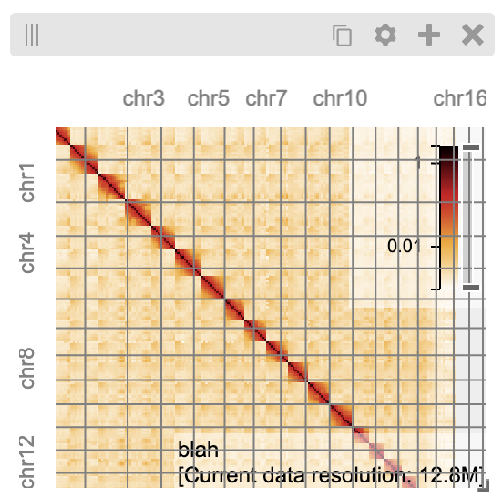

Getting Started
###############

**higlass-python** is a Python interface for HiGlass. It simplifies authoring
HiGlass view configs and offers additional features to load and visualize local
datasets as well as extend HiGlass server functionality.

Key features
------------

- **Author validated HiGlass view configs** with a simplified API
- **Render interactive visualizations** as standalone HTML or interactive Jupyter Widgets
- Load **local, remote, and in-memory datasets** via a light-weight, anywidget-based HiGlass server
- Extend HiGlass server with **custom tilesets**

Example
-------

.. code-block:: bash

    pip install higlass-python

.. code-block:: python

    import higlass as hg

    # Remote data source (tileset)
    tileset1 = hg.remote(
        uid="CQMd6V_cRw6iCI_-Unl3PQ",
        server="https://higlass.io/api/v1/",
        name="Rao et al. (2014) GM12878 MboI (allreps) 1kb",
    )

    # Local tileset
    tileset2 = hg.cooler("../data/dataset.mcool")

    # Create a `hg.HeatmapTrack` for each tileset
    track1 = tileset1.track("heatmap")
    track2 = tileset2.track("heatmap")

    # Create two independent `hg.View`s, one for each heatmap
    view1 = hg.view(track1, width=6)
    view2 = hg.view(track2, width=6)

    # Lock zoom & location for each `View`
    view_lock = hg.lock(view1, view2)

    # Concatenate views horizontally and apply synchronization lock
    (view1 | view2).locks(view_lock)

.. image:: https://user-images.githubusercontent.com/24403730/159050305-e6a48f03-fba1-4ff7-8eee-2e9c5c40ef88.gif

Whats going on here:

- ``tileset1`` defines a remote tileset (data source), pointing to an exisiting
  HiGlass server.
- ``tileset2`` defines a local tileset, configuring an anywidget-based HiGlass server
  to serve tiles from the included cooler file.
- ``track1`` and ``track2`` specify separate ``hg.HeatmapTrack`` objects derived
  from the above tilesets, which are inserted into two separate views (``view1`` and ``view2`` respectively).
- ``view_lock`` is an ``hg.Lock`` instance, defining an abstract link between the two views.
- Finally, the two views are concatenated horizontally into a single ``hg.Viewconf`` (via the ``|`` operator),
  and lock is used to sync the zoom and location.

Simplest use case
------------------

The simplest way to instantiate a HiGlass instance to create a View with an axis Track:

.. code-block:: python

   import higlass as hg

   hg.view(hg.track("top-axis"))

The ``hg.track`` and ``hg.view`` utilties provide a flexibile API for creating and composing
multiple HiGlass Views and Tracks. The ``hg.view`` utility accepts one or more tracks as
positional arguments, and view-level properties are specified via keyword-only arguments.

.. code-block:: python

   import higlass as hg

   hg.view(
       hg.track("top-axis"),
       hg.track("left-axis"),
       width=6,
   )

By default, track positions are are inferred via track type but may be overriden or
provided explicitly as a tuple of ``(hg.Track, "top" | "right" | "bottom" | "left")``.

.. code-block:: python

   import higlass as hg

   hg.view(
       (hg.track("top-axis"), "top"),
       (hg.track("left-axis"), "left"),
       width=6,
   )

Creating a viewconf
-------------------

At it's core, **higlass-python** is a Python interface for authoring
and composing validated HiGlass view configs. This core API can
be used outside of Jupyter notebooks to load or export HiGlass
configurations without any rendering. For example, creating and
exporting a view config as JSON:

.. code-block:: python

  import higlass as hg

  pileup_track = hg.track("pileup").properties(
      data={"type": "bam", "url": "my_bam"},
  ).opts(
      axisPositionHorizontal="right",
  )
  view = hg.view(hg.track("top-axis"), (pileup_track, "top"))
  view.viewconf().json() # or .dict() for a Python dict

  # {
  #   "editable": true,
  #   "viewEditable": true,
  #   "tracksEditable": true,
  #   "views": [
  #     {
  #       "layout": { "x": 0, "y": 0, "w": 12, "h": 6 },
  #       "tracks": {
  #         "top": [
  #           {
  #             "type": "top-axis",
  #             "uid": "5f8433fc-9b7a-48a2-b4c3-bccddf8a0bee"
  #           },
  #           {
  #             "type": "pileup",
  #             "uid": "68405ebc-08b2-469a-ab96-ea7925a39ae2",
  #             "options": {
  #               "axisPositionHorizontal": "right"
  #             },
  #             "data": {
  #               "type": "bam",
  #               "url": "my_bam"
  #             }
  #           }
  #         ]
  #       },
  #       "uid": "2d774b94-fc5d-49c2-9c51-bbad9fa6e73f",
  #       "zoomLimits": [1, null]
  #     }
  #   ]
  # }

or loading an existing view config via URL to access a sub-track:

.. code-block:: python

  import higlass as hg

  viewconf = hg.Viewconf.from_url("https://higlass.io/api/v1?d=default")
  viewconf.views[0].tracks.top[0].json()

  # {
  #   "tilesetUid": "OHJakQICQD6gTD7skx4EWA",
  #   "server": "//higlass.io/api/v1",
  #   "type": "horizontal-gene-annotations",
  #   "uid": "OHJakQICQD6gTD7skx4EWA",
  #   "height": 60,
  #   "options": {
  #     "name": "Gene Annotations (hg19)"
  #   }
  # }

Add Genome Position SearchBox
-----------------------------

.. code-block:: python

    import higlass as hg
    
    mm10 = hg.remote(
        uid="QDutvmyiSrec5nX4pA5WGQ",
        server="//higlass.io/api/v1",
    )
    
    view1 = hg.view(
    
        mm10.track("gene-annotations",height=150).opts(
            minHeight = 24,
        ),
        genomePositionSearchBox = hg.GenomePositionSearchBox(
            autocompleteServer="//higlass.io/api/v1",
            autocompleteId="OHJakQICQD6gTD7skx4EWA",
            chromInfoId="hg19",
            chromInfoServer="//higlass.io/api/v1",
            visible=True)
    )
    
    #In order to get access to track sources from higlass.io data sources
    list_of_track_source_servers = [
        "//higlass.io/api/v1",
        "https://resgen.io/api/v1/gt/paper-data"
      ]
    
    view1.viewconf(trackSourceServers = list_of_track_source_servers, exportViewUrl = "/api/v1/viewconfs")

View extent
-----------

The extent of a view can be set using the ``hg.View.domain()`` method,
either in 1D:

.. code-block:: python

   import higlass as hg

   view = hg.view(hg.track("top-axis")).domain(x=[0, 1e7])

or 2D:

.. code-block:: python

   import higlass as hg

   view = hg.view(hg.track("heatmap")).domain(x=[0, 1e7], y=[0, 1e7])

Track Types
-----------

A list of available track types can be found in the `documentation for HiGlass
<https://docs.higlass.io/track_types.html>`_. Based on the tileset data type, we can
sometimes provide a recommended track type as well as a recommended position.

.. code-block:: python

  import higlass as hg

  tileset = hg.cooler("./data.mcool")
  track = tileset.track() # defaults to 'heatmap'
  view = hg.view(track)   # defaults to 'center' position

Combining Tracks
----------------

Overlaying tracks
^^^^^^^^^^^^^^^^^

Tracks may be combined with the ``hg.combine()`` utility:

.. code-block:: python

   import higlass as hg

   tileset = hg.remote(
       uid="F2vbUeqhS86XkxuO1j2rPA",
       server="//higlass.io/api/v1",
   )

   combined_track = hg.combine(
       hg.track("top-axis"),
       tileset.track("horizontal-bar")
   )

   hg.view((combined_track, "top")).domain(x=[0, 1e9])

Chromosome grid on a heatmap
^^^^^^^^^^^^^^^^^^^^^^^^^^^^

.. code-block:: python

    from higlass.tilesets import ClodiusTileset
    from clodius.tiles.chromsizes import tileset_info
    import higlass as hg

    def chromsizes_tileset(filepath):
        return ClodiusTileset(
            datatype='chromsizes',
            tiles_impl=None,
            info_impl=lambda: tileset_info(filepath)
        )
            
    cs_ts = chromsizes_tileset('chromSizes_hg19_reordered.tsv')
    cool_ts = hg.cooler("my.multires.cool")

    hg.view(
        (hg.combine(
            cool_ts.track(options={"name": "blah"}),
            cs_ts.track('2d-chromosome-grid'),
        position='center'), 'center'),
        (cs_ts.track('horizontal-chromosome-labels'), 'top'),
        (cs_ts.track('horizontal-chromosome-labels'), 'left'),
        width=6)

Multiple Views
--------------

Multiple views are instantiated separately and can be arranged on a grid
that is 12 units wide and an arbitrary number of units high. To create two
side by side views, set both to be 6 units wide and use the ``|`` operator
to concatenate horizontally. The ``/`` operator can be used to stack vertically.

.. code-block:: python

    import higlass as hg

    view1 = hg.view(hg.track("top-axis"), width=6)
    view2 = hg.view(hg.track("top-axis"), width=6)

    view1 | view2

.. image:: img/two-simple-views.png

Synchronization
---------------

Views and track can be synchronized by location, zoom level and values scales.

Zoom and Location locks
^^^^^^^^^^^^^^^^^^^^^^^

Location locks ensure that when one view is panned, all synchronized views pan
with it. Zoom locks do the same with zoom level. Locks are specified by linking
two or more views together via the ``hg.lock`` utility, and then passing the created
lock to ``hg.Viewconf.locks()``. 

.. code-block:: python

    lock = hg.lock(view1, view2)
    (view1 | view2).locks(lock)

Both zoom and location are synchronized by default, but locks can be applied specifically
via the ``zoom`` or ``location`` keyword arguments:

.. code-block:: python

    lock = hg.lock(view1, view2)

    (view1 | view2).locks(lock) # both zoom and location

    (view1 | view2).locks(zoom=lock) # zoom only

    (view1 | view2).locks(location=lock) # location only

Viewport Projection
-------------------

Viewport projections can be applied via the ``hg.View.project()`` method.
This method creates a new track with the viewport bounds of one view and
appends this newly created track onto another view (i.e., a projection).

.. code-block:: python

    view1 = hg.view(track1, width=6)
    view2 = hg.view(track2, width=6)

    view1.project(view2, to="center") | view2

Note that viewport projections always need to be paired with other non-
viewport projections. Multiple ViewportProjection tracks can, however, be
combined, as long as they are associated with regular tracks.

Dataset Arithmetic
-------------------

HiGlass supports client-side division between quantitative datasets with a "divided" track.
This makes it possible to quickly compare two datasets by visualizing their ratio as computed
on loaded tiles rather than the entire dataset:

.. code-block:: python

    hg.divide(
        tileset1.track("heatmap"),
        tileset2.track("heatmap"),
    )

A full example can be found below:

.. code-block:: python

    tset1 = hg.remote(
        uid="CQMd6V_cRw6iCI_-Unl3PQ",
        name="Rao et al. (2014) GM12878 MboI (allreps) 1kb",
    )

    tset2 = hg.remote(
        uid="QvdMEvccQuOxKTEjrVL3wA",
        name="Rao et al. (2014) K562 MboI (allreps) 1kb",
    )

    t1 = tset1.track("heatmap", height=300)
    t2 = tset2.track("heatmap", height=300)

    t3 = hg.divide(t1, t2).opts(
        colorRange=["blue", "white", "red"],
        valueScaleMin=0.1,
        valueScaleMax=10,
    )

    domain = (7e7, 8e7)
    v1 = hg.view(t1, width=4).domain(x=domain)
    v2 = hg.view(t2, width=4).domain(x=domain)
    v3 = hg.view(t3, width=4).domain(x=domain)

    (v1 | v3 | v2).locks(hg.lock(v1, v2, v3))

.. image:: img/divided-by-track.png

Other Examples
--------------

The examples below demonstrate how to use the HiGlass Python API to view data
locally in a Jupyter notebook or a browser-based HiGlass instance.

Jupyter HiGlass Component
^^^^^^^^^^^^^^^^^^^^^^^^^

To instantiate a HiGlass component within a Jupyter notebook, we first need
to specify which data should be loaded. This is accomplished either by 
specifying a local tileset (via ``hg.cooler``, ``hg.bigwig``, ``hg.multivec``,
``hg.hitile``, ``hg.bed2ddb``) or connecting to an existing HiGlass Server
with ``hg.remote()``:

.. code-block:: python

    import higlass as hg

    tileset = hg.remote(
        uid="CQMd6V_cRw6iCI_-Unl3PQ",
        server="http://higlass.io/api/v1/",
    )

    view = hg.view(
        hg.track("top-axis"),
        tileset.track("heatmap", height=250).opts(
            valueScaleMax=0.5,
        ),
    )

Remote bigWig Files
^^^^^^^^^^^^^^^^^^^

bigWig files can be loaded either from the local disk or from remote http
servers. The example below demonstrates how to load a remote bigWig file from
the UCSC genome browser's archives. Note that this is a network-heavy operation
that may take a long time to complete with a slow internet connection.

.. code-block:: python

    import higlass as hg

    tileset = hg.bigwig(
        'http://hgdownload.cse.ucsc.edu/goldenpath/hg19/encodeDCC/'
        'wgEncodeSydhTfbs/wgEncodeSydhTfbsGm12878InputStdSig.bigWig')

    hg.view(tileset.track("horizontal-bar"))

For a better user experience, we recommend downloading the data locally first.

.. code-block:: bash

    !wget http://hgdownload.cse.ucsc.edu/goldenpath/hg19/encodeDCC/wgEncodeSydhTfbs/wgEncodeSydhTfbsGm12878InputStdSig.bigWig

.. code-block:: python

    import higlass as hg

    tileset = hg.bigwig('./wgEncodeSydhTfbsGm12878InputStdSig.bigWig')

    hg.view(tileset.track("horizontal-bar"))

Serving local data
^^^^^^^^^^^^^^^^^^

To enable the viewing of local data, **higlass-python** runs a temporary
light-weight HiGlass server in a *background thread*. This temporary
server is only started if a local tileset is used and will only persist
for the duration of the Python session.

Cooler Files
""""""""""""

We provide a top-level convenience function, ``hg.cooler``, for adding
cooler tilesets to the background server:

.. code-block:: python

    import higlass as hg

    # Adds a tileset to a background HiGlass server
    tileset = hg.cooler("../data/Dixon2012-J1-NcoI-R1-filtered.100kb.multires.cool")

    # View the local tileset
    hg.view(tileset.track("heatmap"))

.. image:: img/jupyter-hic-heatmap.png

The background server is exposed globally and may be configured
with other custom tilesets.

.. code-block:: python

    import higlass as hg

    # add a custom tileset manually
    ts_custom = hg.server.add(MyCustomTileset())

    # calls hg.server.add() internally
    ts = hg.cooler("../data/Dixon2012-J1-NcoI-R1-filtered.100kb.multires.cool")

    v1 = hg.view(ts.track("heatmap"), width=6)
    v2 = hg.view(ts_custom.track("heatmap"), width=6)

    v1 | v2

You can clear all active server resources by reseting the server:

.. code-block:: python

    hg.server.reset()

BigWig Files
""""""""""""

The top-level `hg.bigwig` utility is available for viewing local
bigWig files. The returned tileset can be used to create both a
chromosome labels track and a horizontal bar track for these data.

.. code-block:: python

    import higlass as hg

    ts = hg.bigwig("../data/wgEncodeCaltechRnaSeqHuvecR1x75dTh1014IlnaPlusSignalRep2.bigWig")

    hg.view(
        hg.track("top-axis"),
        ts.track("chromosome-labels"),
        ts.track("horizontal-bar"),
    )

.. image:: img/jupyter-bigwig.png

Serving custom data
^^^^^^^^^^^^^^^^^^^

To display data, we need to define a tileset. Tilesets define two functions:
``info``:

.. code-block:: python

    > from higlass.tilesets import bigwig
    > ts1 = bigwig('http://hgdownload.cse.ucsc.edu/goldenpath/hg19/encodeDCC/wgEncodeSydhTfbs/wgEncodeSydhTfbsGm12878InputStdSig.bigWig')
    > ts1.info()
    {
     'min_pos': [0],
     'max_pos': [4294967296],
     'max_width': 4294967296,
     'tile_size': 1024,
     'max_zoom': 22,
     'chromsizes': [['chr1', 249250621],
                    ['chr2', 243199373],
                    ...],
     'aggregation_modes': {'mean': {'name': 'Mean', 'value': 'mean'},
                           'min': {'name': 'Min', 'value': 'min'},
                           'max': {'name': 'Max', 'value': 'max'},
                           'std': {'name': 'Standard Deviation', 'value': 'std'}},
     'range_modes': {'minMax': {'name': 'Min-Max', 'value': 'minMax'},
                     'whisker': {'name': 'Whisker', 'value': 'whisker'}}
     }

and ``tiles``:

.. code-block:: python

    > ts1.tiles(['x.0.0'])
    [('x.0.0',
      {'min_value': 0.0,
       'max_value': 9.119079544037932,
       'dense': 'Rh25PwcCcz...',   # base64 string encoding the array of data
       'size': 1,
       'dtype': 'float32'})]

The tiles function will always take an array of tile ids of the form ``id.z.x[.y][.transform]``
where ``z`` is the zoom level, ``x`` is the tile's x position, ``y`` is the tile's
y position (for 2D tilesets) and ``transform`` is some transform to be applied to the
data (e.g. normalization types like ``ice``).

Numpy Matrix
""""""""""""

By way of example, let's explore a numpy matrix by implementing the ``info`` and ``tiles``
functions described above. To start let's make the matrix using the
`Eggholder function <https://en.wikipedia.org/wiki/Test_functions_for_optimization>`_.

.. code-block:: python

    import numpy as np

    dim = 2000
    I, J = np.indices((dim, dim))
    data = (
        -(J + 47) * np.sin(np.sqrt(np.abs(I / 2 + (J + 47))))
        - I * np.sin(np.sqrt(np.abs(I - (J + 47))))
    )

Then we can define the data and tell the server how to render it.

.. code-block:: python

    import higlass as hg
    from  clodius.tiles import npmatrix
    from higlass.tilesets import LocalTileset

    ts = hg.server.add(
        LocalTileset(
            info=lambda: npmatrix.tileset_info(data),
            tiles=lambda tids: npmatrix.tiles_wrapper(data, tids),
            uid="example-npmatrix",
            datatype="matrix",
        )
    )

    hg.view(
        hg.track("top-axis"),
        hg.track("left-axis"),
        ts.track("heatmap", height=250).opts(valueScaleMax=0.5),
    )

.. image:: img/eggholder-function.png
